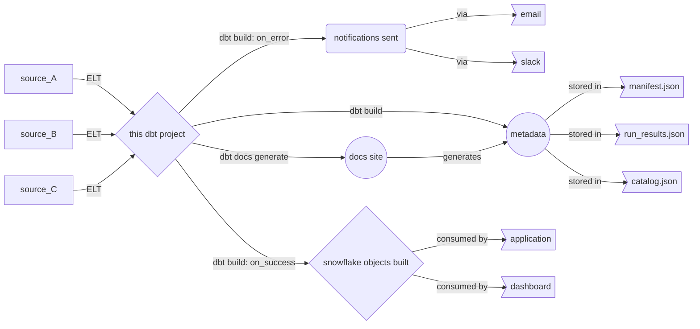
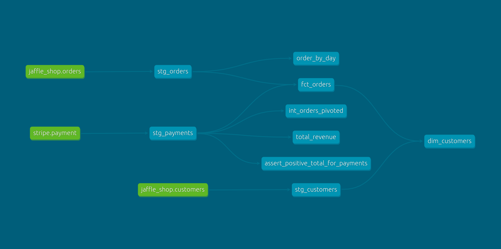

# shiny-happiness

<a name="top-">

<p align="center">

[](https://github.com/eon-collective/the_office/actions/workflows/dbt_sql_linting.yml)

<p align="center">

[](https://github.com/eon-collective/the_office/actions/workflows/dbt_ci_pipe.yml)

</p>

<p align="center">

[](https://github.com/eon-collective/the_office/actions/workflows/evaluator_pipe.yml)

</p>

# Welcome to Eon Collective dbt® Project Template

## Table Of Contents <a name="toc-"></a>
- [Versions](#versions-)
    - [Revision History](#project_revisionhistory)
    - [dbt Project Version](#dbt_project_version_info)
- [Overview](#dbt_project_overview)
- [Application Functional Overview](#dbt_project_components)
    - [Project Input](#dbt_project_input)
        - [Source Data from Raw Layer](#dbt_project_input_source_tables)
        - [Static/Seeds](#dbt_project_input_static_or_seeds)
    - [Cleansing/Transformation](#dbt_project_cleansing_and_transformation)
    - [Project Output](#dbt_project_output)
    - [Data Lineage](#dbt_project_data_lineage)
    - [Functional Context](#dbt_project_functional_context)
- [Using This dbt Project](#dbt_project_using_this_one)
    - [Project Structure](#dbt_project_structure)
    - [Permissions](#dbt_project_permissions)
    - [Project Settings](#dbt_project_settings)
    - [Project Packages/Dependencies](#dbt_project_packages_dependencies)
    - [Development Environment Setup](#dbt_project_development_environnment)
        - [Local Development: VSCode/Atom etc](#dbt_project_input_local_development)
        - [Developing in the Cloud IDE](#dbt_project_input_cloud_ide_development)
- [dbt Commands: How to Run](#dbt_project_howtorun)
    - [To get dependencies](#dbt_howtorun_deps)
    - [To compile the dbt project](#dbt_howtorun_compile)
    - [To get the documentation](#dbt_howtorun_docsgenerate)
    - [Loading static/seed files](#dbt_howtorun_seed)
    - [Mart build](#dbt_howtorun_martbuild)
    - [List Project resources](#dbt_howtorun_ls)
- [Control/Audit Framework/Monitoring](#dbt_project_audit_control_framework)
- [Testing](#dbt_project_testing)
    - [Continues Integration: GitHub Action Pipelines](#dbt_project_ci)
        - [Credentials](#dbt_project_ci_credentials)
        - [Pipe Setup](#dbt_project_ci_pipe_setup)
    - [dbt Tests](#dbt_ci_dbt_tests)
- [Deployment](#dbt_project_deployment)
    - [Continuous Deployment: dbt_runner](#dbt_cd_dbt_runner)
        - [Credentials](#dbt_project_cd_credentials)
        - [Alerts](#dbt_project_cd_alerts)
        - [Job Names](#dbt_project_cd_job_names)
        - [Adhoc Runs](#dbt_project_adhoc_runs)
            - [(Re-)Loading seeded files](#dbt_project_adhoc_runs_seeds)
            - [(Re-)Loading static S3 files](#dbt_project_adhoc_runs_s3_files)
        - [Orchestration](#dbt_project_cd_orchestration)
- [Support Team Structure](#dbt_project_support_team_structure)
- [Service Level Agreements (SLA)](#dbt_project_sla)
- [Troubleshoot/ F.A.Q](#dbt_troubleshoot)
    - [known Issues](#dbt_troubleshoot_known_issues)
    - [Debugging](#dbt_troubleshoot_debugging)
- [Migration Notes](#dbt_project_migration_notes)
- [Resources](#resources-)
- [Cutover Plan](#cutover_plan)


# Versions <a name="versions-"></a> [↑](#toc-)

## Revision History <a name="project_revisionhistory"></a> [↑](#toc-)

| **Version** | **Revision Date** |
|:-----------:|:-----------------:|
|    v1.6     |   Jul 31, 2023    |

## dbt Project Version <a name="dbt_project_version_info"></a> [↑](#toc-)

| **Version** | **Latest Version used for testing** | 
|:-----------:|:-----------------------------------:| 
| 1.0.0       |       1.0.3                         | 


# Overview <a name="dbt_project_overview"></a> [↑](#toc-)


# Application Functional Overview <a name="dbt_project_components"></a> [↑](#toc-)



## Project Input <a name="dbt_project_input"></a> [↑](#toc-)

###  Source Data from Raw Layer  <a name="dbt_project_input_source_tables"></a> [↑](#toc-)

The following raw tables are consumed by this project

| **DATABASE** | **SCHEMA**  | **TABLE** | **NOTES** |
|:------------:|:-----------:|:---------:|:---------:|
| RAW          | JAFFLE_SHOP | CUSTOMERS |   Data from a customer table in Jaffle Shop has been loaded from a CSV file located in a public [S3 bucket](s3://dbt-tutorial-public/jaffle_shop_customers.csv)        |
| RAW          | JAFFLE_SHOP | ORDERS    |    Data from an orders table in Jaffle Shop has been loaded from a CSV file located in a public S3 bucket.       |
| RAW          | STRIPE      | PAYMENT   |   Data on the payment of Jaffle Shop in Stripe has been loaded from a CSV file located in a public S3 bucket.        |


[↑](#toc-)
###  Static/Seeds <a name="dbt_project_input_static_or_seeds"></a>


The following seeds are present in the project:

| **FILENAME** | **DATABASE** |  **SCHEMA**   |             **SEED**             | **NOTES** |
|:------------:|:------------:|:-------------:|:--------------------------------:|:---------:|
|              |  ANALYTICS   | DBT_DMALUNGU  | DBT_PROJECT_EVALUATOR_EXCEPTIONS |           |
|              |   ANALYTIC   | DBT_DMALUNGU  |            EMPLOYEES             |           |


## Cleansing/Transformation <a name="dbt_project_cleansing_and_transformation"></a> [↑](#toc-)

This project handles the following transformations/cleansing or curation details during its execution.

| **DATABASE** |  **SCHEMA**   |   **MODEL**    | **MATERIALIZATION** | **TAGS** |                                                                     **NOTES**                                                                     |
|:------------:|:-------------:|:--------------:|:-------------------:|:--------:|:-------------------------------------------------------------------------------------------------------------------------------------------------:|
| ANALYTICS    | DBT_DMALUNGU  | STG_CUSTOMERS  | VIEW                | []       |                        - Renamed `id` to `customer_id`, Created new column `full_name` from  `first_name` and `last_name`                         |
|  ANALYTICS   | DBT_DMALUNGU  |     STG_ORDERS | VIEW                | []       |                                                               - Renamed `user_id` to `customer_id` and `id` to `order_id`                         |
|  ANALYTICS   |  DBT_DMALUNGU |  STG_PAYMENTS  | VIEW                | []       | - Renamed `id` to `payment_id` , `orderid` to `order_id` , `papaymentymentmethod` to  `payment_method`, and  Used Marcos convert cents to dollars |
|  ANALYTICS   | DBT_DMALUNGU  |   FCT_ORDERS   | TABLE               | []       |                                   - Adding `amount` details to orders by joing `stg_orders` and `stg_payments`                                    |
|  ANALYTICS   | DBT_DMALUNGU  |   INT_ORDERS   | TABLE               | []       |                                            - Pivote table of table `stg_payments` on `payment_method`                                             |


## Project Output <a name="dbt_project_output"></a> [↑](#toc-)

This project produces the following tables in snowflake i.e models that don't have any child.

| DATABASE   | SCHEMA        | MODEL                                          | MATERIALIZATION | TAGS | NOTES |
|------------|---------------|------------------------------------------------|-----------------|------|-------|
| ANALYTICS  | DBT_DMALUNGU  | STG_CUSTOMERS                                  | VIEW            | []   |       |
| ANALYTICS  | DBT_DMALUNGU  | STG_ORDERS                                     | VIEW            | []   |       |
| ANALYTICS  | DBT_DMALUNGU  | STG_PAYMENTS                                   | VIEW            | []   |       |
| ANALYTICS  | DBT_DMALUNGU  | INT_ORDERS_PIVOTED                             | TABLE           | []   |       |
| ANALYTICS  | DBT_DMALUNGU  | FCT_ORDERS                                     | TABLE           | []   |       |
| ANALYTICS  | DBT_DMALUNGU  | DIM_CUSTOMERS                                  | TABLE           | []   |       |
| ANALYTICS  | DBT_DMALUNGU  | DIM_DBT__SEEDS                                 | VIEW            | []   |       |
| ANALYTICS  | DBT_DMALUNGU  | FCT_DBT__SEED_EXECUTIONS                       | VIEW            | []   |       |
| ANALYTICS  | DBT_DMALUNGU  | DIM_DBT__SOURCES                               | VIEW            | []   |       |
| ANALYTICS  | DBT_DMALUNGU  | FCT_DBT__MODEL_INFORMATION                     | VIEW            | []   |       |
| ANALYTICS  | DBT_DMALUNGU  | FCT_DBT__INVOCATIONS                           | VIEW            | []   |       |
| ANALYTICS  | DBT_DMALUNGU  | FCT_DBT__SNAPSHOT_EXECUTIONS                   | VIEW            | []   |       |
| ANALYTICS  | DBT_DMALUNGU  | DIM_DBT__EXPOSURES                             | VIEW            | []   |       |
| ANALYTICS  | DBT_DMALUNGU  | DIM_DBT__MODELS                                | VIEW            | []   |       |
| ANALYTICS  | DBT_DMALUNGU  | DIM_DBT__TESTS                                 | VIEW            | []   |       |
| ANALYTICS  | DBT_DMALUNGU  | DIM_DBT__CURRENT_MODELS                        | VIEW            | []   |       |
| ANALYTICS  | DBT_DMALUNGU  | FCT_DBT__MODEL_EXECUTIONS                      | VIEW            | []   |       |
| ANALYTICS  | DBT_DMALUNGU  | DIM_DBT__SNAPSHOTS                             | VIEW            | []   |       |
| ANALYTICS  | DBT_DMALUNGU  | FCT_DBT__TEST_EXECUTIONS                       | VIEW            | []   |       |
| ANALYTICS  | DBT_DMALUNGU  | TESTS                                          | INCREMENTAL     | []   |       |
| ANALYTICS  | DBT_DMALUNGU  | SOURCES                                        | INCREMENTAL     | []   |       |
| ANALYTICS  | DBT_DMALUNGU  | SEED_EXECUTIONS                                | INCREMENTAL     | []   |       |
| ANALYTICS  | DBT_DMALUNGU  | MODEL_EXECUTIONS                               | INCREMENTAL     | []   |       |
| ANALYTICS  | DBT_DMALUNGU  | MODELS                                         | INCREMENTAL     | []   |       |
| ANALYTICS  | DBT_DMALUNGU  | MODEL_INFORMATION                              | INCREMENTAL     | []   |       |
| ANALYTICS  | DBT_DMALUNGU  | SNAPSHOTS                                      | INCREMENTAL     | []   |       |
| ANALYTICS  | DBT_DMALUNGU  | SEEDS                                          | INCREMENTAL     | []   |       |
| ANALYTICS  | DBT_DMALUNGU  | INVOCATIONS                                    | INCREMENTAL     | []   |       |
| ANALYTICS  | DBT_DMALUNGU  | TEST_EXECUTIONS                                | INCREMENTAL     | []   |       |
| ANALYTICS  | DBT_DMALUNGU  | EXPOSURES                                      | INCREMENTAL     | []   |       |
| ANALYTICS  | DBT_DMALUNGU  | SNAPSHOT_EXECUTIONS                            | INCREMENTAL     | []   |       |
| ANALYTICS  | DBT_DMALUNGU  | STG_DBT__MODEL_EXECUTIONS                      | VIEW            | []   |       |
| ANALYTICS  | DBT_DMALUNGU  | STG_DBT__SEED_EXECUTIONS                       | VIEW            | []   |       |
| ANALYTICS  | DBT_DMALUNGU  | STG_DBT__SNAPSHOT_EXECUTIONS                   | VIEW            | []   |       |
| ANALYTICS  | DBT_DMALUNGU  | STG_DBT__SEEDS                                 | VIEW            | []   |       |
| ANALYTICS  | DBT_DMALUNGU  | STG_DBT__INVOCATIONS                           | VIEW            | []   |       |
| ANALYTICS  | DBT_DMALUNGU  | STG_DBT__SOURCES                               | VIEW            | []   |       |
| ANALYTICS  | DBT_DMALUNGU  | STG_DBT__EXPOSURES                             | VIEW            | []   |       |
| ANALYTICS  | DBT_DMALUNGU  | STG_DBT__TESTS                                 | VIEW            | []   |       |
| ANALYTICS  | DBT_DMALUNGU  | STG_DBT__MODEL_INFORMATION                     | VIEW            | []   |       |
| ANALYTICS  | DBT_DMALUNGU  | STG_DBT__TEST_EXECUTIONS                       | VIEW            | []   |       |
| ANALYTICS  | DBT_DMALUNGU  | STG_DBT__SNAPSHOTS                             | VIEW            | []   |       |
| ANALYTICS  | DBT_DMALUNGU  | STG_DBT__MODELS                                | VIEW            | []   |       |
| ANALYTICS  | DBT_DMALUNGU  | FCT_MULTIPLE_SOURCES_JOINED                    | TABLE           | []   |       |
| ANALYTICS  | DBT_DMALUNGU  | FCT_STAGING_DEPENDENT_ON_MARTS_OR_INTERMEDIATE | TABLE           | []   |       |
| ANALYTICS  | DBT_DMALUNGU  | FCT_HARD_CODED_REFERENCES                      | TABLE           | []   |       |
| ANALYTICS  | DBT_DMALUNGU  | FCT_DIRECT_JOIN_TO_SOURCE                      | TABLE           | []   |       |
| ANALYTICS  | DBT_DMALUNGU  | FCT_MARTS_OR_INTERMEDIATE_DEPENDENT_ON_SOURCE  | TABLE           | []   |       |
| ANALYTICS  | DBT_DMALUNGU  | FCT_STAGING_DEPENDENT_ON_STAGING               | TABLE           | []   |       |
| ANALYTICS  | DBT_DMALUNGU  | FCT_SOURCE_FANOUT                              | TABLE           | []   |       |
| ANALYTICS  | DBT_DMALUNGU  | FCT_REJOINING_OF_UPSTREAM_CONCEPTS             | TABLE           | []   |       |
| ANALYTICS  | DBT_DMALUNGU  | FCT_ROOT_MODELS                                | TABLE           | []   |       |
| ANALYTICS  | DBT_DMALUNGU  | FCT_UNUSED_SOURCES                             | TABLE           | []   |       |
| ANALYTICS  | DBT_DMALUNGU  | FCT_DUPLICATE_SOURCES                          | TABLE           | []   |       |
| ANALYTICS  | DBT_DMALUNGU  | FCT_MODEL_NAMING_CONVENTIONS                   | VIEW            | []   |       |
| ANALYTICS  | DBT_DMALUNGU  | FCT_SOURCE_DIRECTORIES                         | VIEW            | []   |       |
| ANALYTICS  | DBT_DMALUNGU  | FCT_TEST_DIRECTORIES                           | VIEW            | []   |       |
| ANALYTICS  | DBT_DMALUNGU  | FCT_MODEL_DIRECTORIES                          | VIEW            | []   |       |
| ANALYTICS  | DBT_DMALUNGU  | FCT_CHAINED_VIEWS_DEPENDENCIES                 | VIEW            | []   |       |
| ANALYTICS  | DBT_DMALUNGU  | FCT_EXPOSURE_PARENTS_MATERIALIZATIONS          | VIEW            | []   |       |
| ANALYTICS  | DBT_DMALUNGU  | FCT_DOCUMENTATION_COVERAGE                     | VIEW            | []   |       |
| ANALYTICS  | DBT_DMALUNGU  | FCT_UNDOCUMENTED_MODELS                        | VIEW            | []   |       |
| ANALYTICS  | DBT_DMALUNGU  | INT_DIRECT_RELATIONSHIPS                       | VIEW            | []   |       |
| ANALYTICS  | DBT_DMALUNGU  | INT_ALL_GRAPH_RESOURCES                        | TABLE           | []   |       |
| ANALYTICS  | DBT_DMALUNGU  | INT_ALL_DAG_RELATIONSHIPS                      | VIEW            | []   |       |
| ANALYTICS  | DBT_DMALUNGU  | STG_NAMING_CONVENTION_FOLDERS                  | VIEW            | []   |       |
| ANALYTICS  | DBT_DMALUNGU  | STG_NAMING_CONVENTION_PREFIXES                 | VIEW            | []   |       |
| ANALYTICS  | DBT_DMALUNGU  | STG_EXPOSURE_RELATIONSHIPS                     | VIEW            | []   |       |
| ANALYTICS  | DBT_DMALUNGU  | STG_METRICS                                    | TABLE           | []   |       |
| ANALYTICS  | DBT_DMALUNGU  | STG_SOURCES                                    | TABLE           | []   |       |
| ANALYTICS  | DBT_DMALUNGU  | STG_METRIC_RELATIONSHIPS                       | VIEW            | []   |       |
| ANALYTICS  | DBT_DMALUNGU  | STG_EXPOSURES                                  | TABLE           | []   |       |
| ANALYTICS  | DBT_DMALUNGU  | STG_NODE_RELATIONSHIPS                         | TABLE           | []   |       |
| ANALYTICS  | DBT_DMALUNGU  | STG_NODES                                      | TABLE           | []   |       |
| ANALYTICS  | DBT_DMALUNGU  | BASE_EXPOSURE_RELATIONSHIPS                    | TABLE           | []   |       |
| ANALYTICS  | DBT_DMALUNGU  | BASE_NODE_RELATIONSHIPS                        | TABLE           | []   |       |
| ANALYTICS  | DBT_DMALUNGU  | BASE_METRIC_RELATIONSHIPS                      | TABLE           | []   |       |

## Data Lineage <a name="dbt_project_data_lineage"></a> [↑](#toc-)

 
### Sample Data Lineages [↑](#toc-)



## Functional Context <a name="dbt_project_functional_context"></a> [↑](#toc-)


# Using This dbt Project <a name="dbt_project_using_this_one"></a> [↑](#toc-)

## Project structure <a name="dbt_project_structure"></a> [↑](#toc-)

The project structure defined for dbt projects is as defined below:

```bash
./shiny-happiness
├── analyses
│   ├── .gitkeep
│   ├── order_by_day.sql
│   └── total_revenue.sql
├── dbt_project.yml
├── etc
│   └── image
│       ├── dbt-dag.png
│       └── project_tree_structure.md
├── .github
│   └── workflows
│       ├── ci_pipe.yml
│       ├── linting.yml
│       └── project_evaluator.yml
├── .gitignore
├── LICENSE
├── macros
│   ├── cents_to_dollars.sql
│   ├── clean_stale_models.sql
│   ├── .gitkeep
│   ├── grant_select.sql
│   ├── limit_date_in_dev.sql
│   └── log_results.sql
├── models
│   ├── marts
│   │   ├── core
│   │   │   ├── core.yml
│   │   │   ├── dim_customers.sql
│   │   │   └── fct_orders.sql
│   │   └── intermediate
│   │       ├── intermidiate.yml
│   │       └── int_orders_pivoted.sql
│   └── staging
│       ├── jaffle_shop
│       │   ├── jaffle_shop.md
│       │   ├── src_jaffle_shop.yml
│       │   ├── stg_customers.sql
│       │   ├── stg_jaffle_shop.yml
│       │   └── stg_orders.sql
│       └── stripe
│           ├── src_stripe.yml
│           ├── stg_payments.sql
│           └── stg_stripe.yml
├── packages.yml
├── README.md
├── seeds
│   ├── dbt_project_evaluator_exceptions.csv
│   ├── employees.csv
│   └── .gitkeep
├── snapshots
│   ├── .gitkeep
│   └── mock_orders.sql
└── tests
    ├── assert_positive_total_for_payments.sql
    └── .gitkeep
```
This same project tree view above is persisted/versioned under *etc/project_tree_structure.md* - If project changes, please update both markdown documents.


## Permissions <a name="dbt_project_permissions"></a> [↑](#toc-) 

In order for this project to run successfuly, the following permissions are needed on Snowflake. 

| **DATABASE NAME** | **SCHEMA**           | **TABLE NAME** | **PERMISSION** |
|----|----------------------|----------------|----------------|
| `RAW` | JAFFLE_SHOP, STRIPE  | ALL            | READ           |
| `ANALYTICS` | DBT_DMALUNGU, PUBLIC | ALL            | READ & WRITE   |


## Project Settings <a name="dbt_project_settings"></a> [↑](#toc-)

The project settings for these projects are persisted in the `dbt_project.yml` file

### Application Variables <a name="dbt_application_vars"></a> [↑](#toc-)

This application uses the following variables defined in the `dbt_project.yml` file under the `vars` section.

| **Application Argument** | **Default Value** | **Options**                       |                       **Description/Notes**                        |
|:------------------------:|:-----------------:|-----------------------------------|:------------------------------------------------------------------:|
|           env            |       TEST        | `TEST` `DEV` `PROD`               |       Controls which environment the source data comes from        |


*The variables should be passed to the application from the command line at runtime. Examples:*

1. Run a monthly refresh using the TEST_RAW environment `dbt run --vars '{refresh_type: MONTHLY}'` 
2. Run a refresh from 201801 - 202201 using the PROD_RAW environment `dbt run --vars '{refresh_type: CUSTOM, fmthid_start: 201801, fmth_id_end: 202201, env: PROD}'`

## Project Packages/Dependencies <a name="dbt_project_packages_dependencies"></a> [↑](#toc-)

| Package           | Version | Usage                                                                                    |
|-------------------|---------|------------------------------------------------------------------------------------------|
| dbt_utils         | 0.8.0   | Used for reusable macros and utils from dbt                                              |
| audit_helper      | 0.8.0   | package used to compare two models                                                       |
| project_evaluator | 0.3.0   | package used Automatically evaluate your dbt project for alignment with best practices   |
| dbt_artifacts     | 0.2.0   | package used to builds a mart of tables and views describing the project                 |


## Development Environment Setup <a name="dbt_project_development_environnment"></a> [↑](#toc-)

There are two possible environments where development can happen.

Namely: 
  1. Local Development - this can be IDE that is leveraging dbt core
  2. Cloud IDE - dbt cloud environment

Below are instructions to get setup on both of these environments.

### Local Development: VSCode/Atom etc <a name="dbt_project_input_local_development"></a> [↑](#toc-)


  
1. #### Install Requirements <a name="dbt_project_input_local_development"></a> [↑](#toc-)
    [Install dbt](https://docs.getdbt.com/dbt-cli/installation).   
    Optionally, you can [set up venv to allow for environment switching](https://discourse.getdbt.com/t/setting-up-your-local-dbt-run-environments/2353). 

   2. #### Setup<a name="dbt_project_input_local_development"></a> [↑](#toc-)

       Set up a profile called `dbt_project_template` to connect to a data warehouse by following [these instructions](https://docs.getdbt.com/docs/configure-your-profile). 
       If you have access to a data warehouse, you can use those credentials we recommend setting your [target schema](https://docs.getdbt.com/docs/configure-your-profile#section-populating-your-profile) to be a new schema (dbt will create the schema for you, as long as you have the right privileges). 
       If you don't have access to an existing data warehouse, you can also set up a local postgres database and connect to it in your profile.
       Open your terminal and navigate to your `profiles.yml`. This is in the `.dbt` hidden folder on your computer, located in your home directory.

       On macOS, you can open the file from your terminal similar to this (which is using the Atom text editor to open the file):
       ```console
       $ atom ~/.dbt/profiles.yml
       ```

       Insert the following into your `profiles.yml` file and change out the bracketed lines with your own information.
       [Here is further documentation](https://docs.getdbt.com/docs/available-adapters#dbt-labs-supported) for setting up your profile.
```yml 
dbt_sonwflake:
  target: dev
  outputs:
    dev:
      type: snowflake
      account: <account>.<region>

      # User/password auth
      user: [username]
      password: [password]
      authenticator: username_password_mfa

      role: [user role]
      database: [database name]
      warehouse: [warehouse name]
      schema: [dbt schema]
      threads: [1 or more]
      client_session_keep_alive: False
      query_tag: [anything]

      # optional
      connect_retries: 0 # default 0
      connect_timeout: 10 # default: 10
      retry_on_database_errors: False # default: false
      retry_all: False  # default: false
      reuse_connections: False # default: false (available v1.4+)
 ```

   | Configuration Key            | Definition                                                                                                                                                                                                              |
   |------------------------------|-------------------------------------------------------------------------------------------------------------------------------------------------------------------------------------------------------------------------|
   | dbt_sonwflake                | This is defining a profile - this specific name should be the profile that is referenced in our dbt_project.yml                                                                                                         |
   | target: dev                  | This is the default environment that will be used during our runs.                                                                                                                                                      |
   | outputs:                     | This is a prompt to start defining targets and their configurations. You likely won't need more than `dev`, but this and any other targets you define can be used to accomplish certain functionalities throughout dbt. |
   | dev:                         | This is defining a target named `dev`.                                                                                                                                                                                  |
   | type: [warehouse_name]       | This is the type of target connection we are using, based on our warehouse.                                                                                                                                             |
   | threads: 50                  | This is the amount of concurrent models that can run against our warehouse, for this user, at one time when conducting a `dbt run`                                                                                      |
   | account: <account>.<region>1 | Change this out to the warehouse's account.                                                                                                                                                                             |
   | user: [your_username]        | Change this to use your own username that you use to log in to the warehouse.                                                                                                                                           |
   | password: [password]         | This is the user password                                                                                                                                                                                               |
   | role: transformer            | This is the role that has the correct permissions for working in this project.                                                                                                                                          |
   | database: analytics          | This is the database name where our models will build                                                                                                                                                                   |
   | schema: dbt_[userid]         | Change this to a custom name. Follow the convention `dbt_userid`. This is the schema that models will build into / test from when conducting runs locally.                                                              |

3. Clone this repository
    
    ```console
    $ https://github.com/eon-collective/shiny-happiness.git
    ```

4. Change into the `shiny-happiness` directory from the command line:
    ```console
    $ cd shiny-happiness
    ```

5. Try running the following generic/common commands one at a time from your command line:
    - ```dbt debug``` - tests your connection. If this fails, check your profiles.yml.
    - ```dbt deps```  - installs any packages defined in the packages.yml file.  


### Developing in the Cloud IDE <a name="dbt_project_input_cloud_ide_development"></a> [↑](#toc-)

The easiest way to contribute to this project is by developing in dbt Cloud. If you have access, navigate to the develop tab in the menu and fill out any required information to get connected.

In the command line bar at the bottom of the interface, run the following generic/common commands one at a time:

- ```dbt deps```  - installs any packages defined in the packages.yml file.

# dbt Commands: How to Run <a name="dbt_project_howtorun"></a> [↑](#toc-)
Assuming you have your environment setup as described in previous section, you can run the following commands to manage this dbt project during deployment.

### To get dependencies:  <a name="dbt_howtorun_deps"></a> [↑](#toc-)

```
dbt deps
```

### To compile the dbt project  <a name="dbt_howtorun_compile"></a> [↑](#toc-)
Generates executable SQL from source model, test, and analysis files. You can find these compiled SQL files in the target/ directory of your dbt project in your development environment. [See dbt docs on compile](https://docs.getdbt.com/reference/commands/compile)

``` 
dbt compile
```

### To get the documentation:  <a name="dbt_howtorun_docsgenerate"></a> [↑](#toc-)
Generate documentation for the project. [See dbt docs on docs generate](https://docs.getdbt.com/reference/commands/cmd-docs#dbt-docs-generate)
```
dbt docs generate --no-compile
```
NOTE: since this project uses call statements in some of the dbt model that execute directly in the DW (snowflake), if dbt runs any compile step which includes `dbt docs generate`, existing data in the mart is lost since the call statements execute with `delete from {{this}} <where condition>`

To view the generated in local IDE, run the following command to start a webserver on default port 8000 and serve the generated documents. [See dbt docs on docs serve](https://docs.getdbt.com/reference/commands/cmd-docs#dbt-docs-serve)
```
dbt docs serve
```
### Loading static/seed files <a name="dbt_howtorun_seed"></a> [↑](#toc-)
Builds any .csv files as tables in the warehouse. These are located in the data/seed folder of the project. 
This materializes the CSVs as tables in your target schema. 
Note that **not all projects require this step** since the assummption that raw data is already in your warehouse. See [dbt docs on seed](https://docs.getdbt.com/docs/building-a-dbt-project/seeds)
```
dbt seed
```

### Mart build <a name="dbt_howtorun_martbuild"></a> [↑](#toc-)

#### The Default Values (SOFT Full Refresh w/ TEST_RAW Environment)
```
dbt run
```
#### A Monthly Refresh w/ the TEST_RAW environment
```
 dbt run --vars '{refresh_type: MONTHLY}'
```
#### A Custom Refresh from 201801 - 202201 w/ the PROD_RAW Environment 
```
 dbt run --vars '{refresh_type: CUSTOM, fmthid_start: 201801, fmth_id_end: 202201, env: PROD}'
```
#### A HARD Full Refresh w/ the PROD_RAW Environment
```
 dbt run --full-refresh --vars'{env: PROD}'
```
<i> Both a HARD & SOFT Full Refresh reloads the previous 36 months of data. A HARD refresh drops and recreates the 
table whereas a SOFT refresh drops and recreates the data.</i>

### List Project resources <a name="dbt_howtorun_ls"></a> [↑](#toc-)

List project resource. [dbt docs on ls command and reference to resource selection syntax](https://docs.getdbt.com/reference/commands/list#overview)
```
 dbt ls
```

[//]: # (# CRT Models)

[//]: # (You can add explanation about special kind of model if exit in the project)

[//]: # (you can use the example bellow as a template)

[//]: # ()
[//]: # (In the `models/onboarding/*` folder there is a collection of models with the prefix `crt_`. These models are a reference/tool to help migrate the data from Redshift to Snowflake.)

[//]: # (They simply execute a `CREATE TABLE IF NOT EXISTS` command to create tables in Snowflake with structures identical to Redshift. Once those tables are converted to DBT models the crt_model)

[//]: # (becomes irrelevant because DBT uses the `CREATE OR REPLACE` command. )

[//]: # (# Control/Audit Framework <a name="dbt_project_audit_control_framework"></a> [↑]&#40;#toc-&#41;)

[//]: # ()
[//]: # (##	Introduction [↑]&#40;#toc-&#41;)

[//]: # (Mart Auditor is a dbt package developed to capture runtime information about marts being executed in Bose COE data )

[//]: # (loads. These runtime metrics can be used to analyze data marts executed in past and for auditing purpose.)

[//]: # ()
[//]: # (##	Design)

[//]: # (Any data mart that is developed in Bose COE project can plug in Mart Auditor package to capture data mart run )

[//]: # (time metrics. Mart Auditor creates two different tables i.e., Batch and Batch_Loging for all marts in database. )

[//]: # (These tables can be used to query to know past executions, errors, execution re try’s etc. )

[//]: # ()
[//]: # (![Scheme]&#40;etc/images/mart_audit_model.png&#41;)

[//]: # ()
[//]: # (Mart Auditor is a light weight dbt package that inserts records into above tables as mart progresses and creates )

[//]: # (table or views as part of model creating and execution. There is only one entry per execution of Mart in Batch )

[//]: # (table and multiple entries one per model in batch_logging table. Association between batch and batch_logging table is: 1 -> M)

[//]: # ()
[//]: # ()
[//]: # ()
[//]: # (###	Batch table structure [↑]&#40;#toc-&#41;)

[//]: # (To get the DDL Structure from Snowflake, run the command: `select get_ddl&#40;'table', 'dev_marts.cf.batch'&#41;;` and it will output the following:)

[//]: # ()
[//]: # (```sql)

[//]: # (create or replace TABLE BATCH &#40;)

[//]: # (	BATCHID NUMBER&#40;38,0&#41;,)

[//]: # (	RETRY_CNT NUMBER&#40;38,0&#41;,)

[//]: # (	DBT_MART VARCHAR&#40;16777216&#41;,)

[//]: # (	DBT_MART_REFRESH_TYPE VARCHAR&#40;16777216&#41;,)

[//]: # (	START_DATE TIMESTAMP_NTZ&#40;9&#41;,)

[//]: # (	END_DATE TIMESTAMP_NTZ&#40;9&#41;,)

[//]: # (	DURATION_IN_SECONDS NUMBER&#40;38,0&#41;,)

[//]: # (	LOAD_STATUS VARCHAR&#40;16777216&#41;)

[//]: # (&#41;;)

[//]: # (```)

[//]: # ()
[//]: # (###	Batch_logging table structure [↑]&#40;#toc-&#41;)

[//]: # (To get the DDL Structure from Snowflake, run the command: `select get_ddl&#40;'table', 'dev_marts.cf.batch_logging'&#41;;` and it will output the following:)

[//]: # ()
[//]: # (```jql)

[//]: # (create or replace TABLE BATCH_LOGGING &#40;)

[//]: # (	BLG_KEY NUMBER&#40;38,0&#41;,)

[//]: # (	BATCHID NUMBER&#40;38,0&#41;,)

[//]: # (	DBT_MART VARCHAR&#40;16777216&#41;,)

[//]: # (	DBT_MART_REFRESH_TYPE VARCHAR&#40;16777216&#41;,)

[//]: # (	DBT_MODEL_NAME VARCHAR&#40;16777216&#41;,)

[//]: # (	SF_TABLE_NAME VARCHAR&#40;16777216&#41;,)

[//]: # (	ROWS_BEFORE NUMBER&#40;38,0&#41;,)

[//]: # (	ROWS_AFTER NUMBER&#40;38,0&#41;,)

[//]: # (	STARTDATE TIMESTAMP_NTZ&#40;9&#41;,)

[//]: # (	COMPLETEDATE TIMESTAMP_NTZ&#40;9&#41;,)

[//]: # (	ERROR_MESSAGE VARCHAR&#40;16777216&#41;)

[//]: # (&#41;;)

[//]: # (```)

[//]: # ()
[//]: # (##	Macros developed in Mart Auditor:  [↑]&#40;#toc-&#41;)

[//]: # (Total 4 macros are developed as part of Mart Auditor dbt package. These macros can be called by any dbt mart by deploying into their dbt mart project.)

[//]: # ()
[//]: # (###	Insert_batch : [↑]&#40;#toc-&#41; )

[//]: # (This macro inserts a record into batch table as soon as mart stars execution. Status in batch table will be inserted as “Started” along with Mart name, BatchID, StartDateTime etc.)

[//]: # ()
[//]: # (###	insert_batch_logging : [↑]&#40;#toc-&#41;)

[//]: # (This macro inserts a record into batch_logging table as soon as any model in dbt mart stars executing. It will insert all the information about models that we execute as part of data mart. Important information like model name, mart name, rows in table/view before model executes, model execution start date time and model execution status as “Started” will be captured into table.)

[//]: # ()
[//]: # (###	update_batch_logging: [↑]&#40;#toc-&#41; )

[//]: # (This macro is developed to validate the model executed by data mart. If a model in mart is executed successfully then this macro updates the previously inserted record in batch_logging table with updated values like status will be updated as completed, rows in table after model executes, end date time for model and Table or View name that macro creates in database.)

[//]: # ()
[//]: # (###	Update_batch : [↑]&#40;#toc-&#41;)

[//]: # (Once all the models in data mart are executed successfully then this macro updates batch table record by changing status to completed and captures information like duration in seconds, retry_count etc. If any of the model in the mart is failed then this macro updates batch table with failed status and increase the retry count value by one.)

[//]: # ()
[//]: # (##	Steps to use Mart Auditor in your dbt mart: [↑]&#40;#toc-&#41; )

[//]: # ()
[//]: # (*Note*: Mart Auditor is available in bitbucket at following location: )

[//]: # ()
[//]: # (Bitbucket Location: )

[//]: # (> ``)

[//]: # ()
[//]: # (1.	Add Mart Auditor package in packages.yml file like below example:)

[//]: # ()
[//]: # ()
[//]: # (2.	Execute `dbt deps` command to deploy mart auditor package into your dbt mart)

[//]: # ()
[//]: # (3.	You can find mart auditor deployed into your dbt *packages* folder of your project)

[//]: # ()
[//]: # (4.	You can call above macros in your dbt_proejct.yml file with below example:)

[//]: # ()
[//]: # (    1. Insert_batch&#40;dbt_mart_name, dbt_mart_refresh_type&#41; : )

[//]: # (        This macro accepts two parameters for Mart_name and Mart_refresh_type. Mart_refresh_type is optional parameter and if you don’t provide refresh type parameter then it will insert NULL value into batch table. Call this macro at “on-run-start” section of dbt_project.yml.)

[//]: # ()
[//]: # (    2. insert_batch_logging &#40;dbt_mart_name, dbt_model_name, table_name, refresh_type&#41;:)

[//]: # (    This macro accepts four parameters for Mart_name, model_name, table_name and refresh_type. Table_name and refresh_type are optional parameters where table name takes model name and refresh_type takes null value by default if you don’t supply. Call this macro at pre-hook section of dbt_project.yml. Pass current model name to the macro with keyword “this”.)

[//]: # ()
[//]: # (    3. Update_batch_logging &#40;dbt_mart_name, dbt_model_name, table_name, refresh_type&#41;:)

[//]: # (    This macro accepts four parameters for Mart_name, model_name, table_name and refresh_type. Table_name and refresh_type are optional parameters where table name takes model name and refresh_type takes null value by default if you don’t supply. Call this macro at post-hook section of dbt_project.yml)

[//]: # ()
[//]: # (    4. update_batch &#40;dbt_mart_name, dbt_mart_refresh_type&#41; : )

[//]: # (    This macro accepts two parameters for Mart_name and Mart_refresh_type. Mart_refresh_type is optional parameter and if you don’t provide refresh type parameter then it will insert null value into batch table. Call this macro at “on-run-end” section of dbt_project.yml.)

[//]: # ()
[//]: # (Dataops Queries for this auditing this mart run are provided in the `analysis` folder with the file name `mart_auditor_dataops.sql`)


# Testing <a name="dbt_project_testing"></a> [↑](#toc-)

## Continuos Integration: GitHub Action Pipelines <a name="dbt_project_ci"></a>                                                             [↑](#toc-)


### Credentials <a name="dbt_project_ci_credentials"></a> [↑](#toc-)

Credentials in a GitHub Action are passed through Repository variables. See more on GitHub Action and environment variables: [User-defined variables](https://docs.github.com/en/actions/learn-github-actions/variables). 

The following GitHub secretes should be configured: 

| Secrete Name        | Values Expected           |
|---------------------|---------------------------|
| DTB_PROFILE_ACCOUNT | snowflake account id      |
| DTB_PROFILE_USER    | Snowflake username        |
| DTB_PROFILE_PW      | Snowflake user password   |
| DTB_PROFILE_ROLE    | Snowflake user role       |
| DTB_PROFILE_DB      | Snowflake database name   |
| DTB_PROFILE_SCHEMA  | dbt schema                |
| DTB_PROFILE_WH      | Snowflake warehouse name  |


### GitHub Action Pipe Setup <a name="dbt_project_ci_pipe_setup"></a> [↑](#toc-)

The dbt project CI pipe is configured as a set of yml files in '.github/workflows'. 

| pipeline name               | pipeline config file location           |Notes|
|-----------------------------|-----------------------------------------|--|
| dbt linting (sqlfluff)      | .github/workflows/linting.yml           |  |
| dbt project evaluator       | .github/workflows/project_evaluator.yml |  |
| dbt project operation test  | .github/workflows/ci_pipe.yml           |  |


## dbt Tests <a name="dbt_ci_dbt_tests"></a> [↑](#toc-)

# Deployment<a name="dbt_project_deployment"></a> [↑](#toc-)

## Continuous Deployment: <a name="dbt_cd_dbt_runner"></a> [↑](#toc-)
### CI pipelines
To facilitates Continuous integration the following ci pipeline have been implemented on this project:
1. dbt linting (sqlfluff) 
2. dbt project evaluator
3. dbt project operation test

This ci plipline can are located at: `.github/workflows` folder in the project:

**Note:**

The above CI pipelines requre the following secrete to be set in the project repo secrete in github action:

| Secrete Name        | Values Expected           |
|---------------------|---------------------------|
| DTB_PROFILE_ACCOUNT | snowflake account id      |
| DTB_PROFILE_USER    | Snowflake username        |
| DTB_PROFILE_PW      | Snowflake user password   |
| DTB_PROFILE_ROLE    | Snowflake user role       |
| DTB_PROFILE_DB      | Snowflake database name   |
| DTB_PROFILE_SCHEMA  | dbt schema                |
| DTB_PROFILE_WH      | Snowflake warehouse name  |

### Alerts <a name="dbt_project_cd_alerts"></a> [↑](#toc-)

Provide details on dbt runner alert notification.

This section should contain the following section 

1. The different kind of error available in the project 
2. The different notification mechanize set up in the project 
3. The individual notified when the different error occur

### Job Names <a name="dbt_project_cd_job_names"></a> [↑](#toc-)
provide dbt runner details here

### Orchestration <a name="dbt_project_cd_orchestration"></a> [↑](#toc-)

provide orchestration details here with orchestration implementation diagram 


# Support Team Structure <a name="dbt_project_support_team_structure"></a> [↑](#toc-)

Below is the support team structure for this project:

| **Team**      | **Contact Information**           |
|---------------|-----------------------------------|
| Build Team    | Daniel Malungu - dbt fundamentals |
| Consumer Team | Public project                    |


# Service Level Agreements (SLA) <a name="dbt_project_sla"></a> [↑](#toc-)

This project utilizes the following SLA schedule.

| **PRIORITY LEVEL** | **TARGET RESPONSE TIME** | **TARGET RESOLUTION TIME** | **SLA CLOCK** |
|--------------------|--------------------------|----------------------------|---------------|
| 1 - Critical       | 30 Minutes               | 4 Hours                    | 24 x 7        |
| 2 - High           | 40 Hours                 | 1 Business Day             | In Region     |
| 3 - Medium         | N/A                      | 5 Business Days            | In Region     |
| 4 - Low            | N/A                      | 10 Business Days           | In Region     |

# Troubleshoot/ F.A.Q <a name="dbt_troubleshoot"></a> [↑](#toc-)

The project FAQ's can be found at:
F
[Project FAQ's](etc/resources/project_faqs.md)

## Known Issues <a name="dbt_troubleshoot_known_issues"></a> [↑](#toc-)
As of the implementation of this project there was no known issues. 

In case of any issue note it in the known issues  md file bellow 

[Known Issues](etc/resources/known_issues.md)

## Debugging <a name="dbt_troubleshoot_debugging"></a> [↑](#toc-)
1. [See dbt docs on Debugging errors](https://docs.getdbt.com/docs/guides/debugging-errors#general-process-of-debugging) - this has a comprehensive list and categorization of common errors seen on a typical dbt project. Note the [common pitfalls section](https://docs.getdbt.com/docs/guides/debugging-errors#common-pitfalls) also


# Resources <a name="resources"></a> [↑](#toc-)

- Learn more about dbt [in the docs](https://docs.getdbt.com/docs/introduction)
- Check out [Discourse](https://discourse.getdbt.com/) for commonly asked questions and answers
- Join the [chat](http://slack.getdbt.com/) on Slack for live discussions and support
- Find [dbt events](https://events.getdbt.com) near you
- Check out [the blog](https://blog.getdbt.com/) for the latest news on dbt's development and best practices
- Check out [dbt Developer blog on git cherry-pick](https://docs.getdbt.com/blog/the-case-against-git-cherry-picking)

# Cutover Plan <a name="cutover_plan"></a> [↑](#toc-)
The project does not have a coverage plan but if a plan exist please provide details in the file bellow:

[Coverage PLan](etc/resources/coverage_plan.md)

[Back to top ↑](#toc-)

