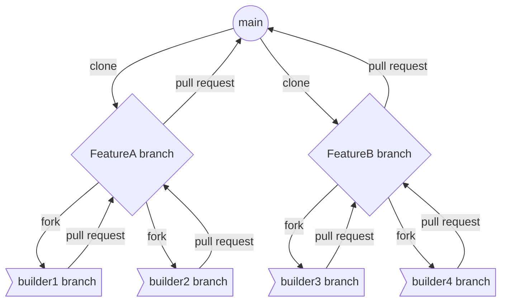

# shiny-happiness

<a name="top-">

<p align="center">

[](https://github.com/eon-collective/the_office/actions/workflows/dbt_sql_linting.yml)

<p align="center">

[](https://github.com/eon-collective/the_office/actions/workflows/dbt_ci_pipe.yml)

</p>

<p align="center">

[](https://github.com/eon-collective/the_office/actions/workflows/evaluator_pipe.yml)

</p>

# Welcome to Eon Collective dbt® Project Template

## Table Of Contents <a name="toc-"></a>
- [Versions](#versions-)
    - [Revision History](#project_revisionhistory)
    - [dbt Project Version](#dbt_project_version_info)
- [Overview](#dbt_project_overview)
- [Application Functional Overview](#dbt_project_components)
    - [Project Input](#dbt_project_input)
        - [Source Data from Raw Layer](#dbt_project_input_source_tables)
        - [Static/Seeds](#dbt_project_input_static_or_seeds)
    - [Cleansing/Transformation](#dbt_project_cleansing_and_transformation)
    - [Project Output](#dbt_project_output)
    - [Data Lineage](#dbt_project_data_lineage)
    - [Functional Context](#dbt_project_functional_context)
- [Using This dbt Project](#dbt_project_using_this_one)
    - [Project Structure](#dbt_project_structure)
    - [Permissions](#dbt_project_permissions)
    - [Project Settings](#dbt_project_settings)
    - [Project Packages/Dependencies](#dbt_project_packages_dependencies)
    - [Development Environment Setup](#dbt_project_development_environnment)
        - [Local Development: VSCode/Atom etc](#dbt_project_input_local_development)
        - [Developing in the Cloud IDE](#dbt_project_input_cloud_ide_development)
- [dbt Commands: How to Run](#dbt_project_howtorun)
    - [To get dependencies](#dbt_howtorun_deps)
    - [To compile the dbt project](#dbt_howtorun_compile)
    - [To get the documentation](#dbt_howtorun_docsgenerate)
    - [Loading static/seed files](#dbt_howtorun_seed)
    - [Mart build](#dbt_howtorun_martbuild)
    - [List Project resources](#dbt_howtorun_ls)
- [Control/Audit Framework/Monitoring](#dbt_project_audit_control_framework)
- [Testing](#dbt_project_testing)
    - [Continuos Integration: Bitbucket Pipelines](#dbt_project_ci)
        - [Credentials](#dbt_project_ci_credentials)
        - [Pipe Setup](#dbt_project_ci_pipe_setup)
    - [dbt Tests](#dbt_ci_dbt_tests)
- [Deployment](#dbt_project_deployment)
    - [Continuous Deployment: dbt_runner](#dbt_cd_dbt_runner)
        - [Credentials](#dbt_project_cd_credentials)
        - [Alerts](#dbt_project_cd_alerts)
        - [Job Names](#dbt_project_cd_job_names)
        - [Adhoc Runs](#dbt_project_adhoc_runs)
            - [(Re-)Loading seeded files](#dbt_project_adhoc_runs_seeds)
            - [(Re-)Loading static S3 files](#dbt_project_adhoc_runs_s3_files)
        - [Orchestration](#dbt_project_cd_orchestration)
- [Support Team Structure](#dbt_project_support_team_structure)
- [Service Level Agreements (SLA)](#dbt_project_sla)
- [Troubleshoot/ F.A.Q](#dbt_troubleshoot)
    - [known Issues](#dbt_troubleshoot_known_issues)
    - [Debugging](#dbt_troubleshoot_debugging)
- [Migration Notes](#dbt_project_migration_notes)
- [Resources](#resources-)
- [Cutover Plan](#cutover_plan)


# Versions <a name="versions-"></a> [↑](#toc-)

## Revision History <a name="project_revisionhistory"></a> [↑](#toc-)

| **Version** | **Revision Date** |
|:-----------:|:-----------------:|
|    v1.6     |   Jul 31, 2023    |

## dbt Project Version <a name="dbt_project_version_info"></a> [↑](#toc-)

|**Version** | **Latest Version used for testing** | 
| :--------: | :---------------------------------: | 
| 1.0.0      |   1.0.3                             | 


# Overview <a name="dbt_project_overview"></a> [↑](#toc-)


# Application Functional Overview <a name="dbt_project_components"></a> [↑](#toc-)


## Project Input <a name="dbt_project_input"></a> [↑](#toc-)

###  Source Data from Raw Layer  <a name="dbt_project_input_source_tables"></a> [↑](#toc-)

The following raw tables are consumed by this project

| **DATABASE** | **SCHEMA**  | **TABLE** | **NOTES** |
|:------------:|:-----------:|:---------:|:---------:|
| RAW          | JAFFLE_SHOP | CUSTOMERS |   Data from a customer table in Jaffle Shop has been loaded from a CSV file located in a public [S3 bucket](s3://dbt-tutorial-public/jaffle_shop_customers.csv)        |
| RAW          | JAFFLE_SHOP | ORDERS    |    Data from an orders table in Jaffle Shop has been loaded from a CSV file located in a public S3 bucket.       |
| RAW          | STRIPE      | PAYMENT   |   Data on the payment of Jaffle Shop in Stripe has been loaded from a CSV file located in a public S3 bucket.        |


[↑](#toc-)
###  Static/Seeds <a name="dbt_project_input_static_or_seeds"></a>

The following static tables are used by this project. Non-seed files are located in the 
's3://bose-bucket/*' folder. They get `COPY INTO` the appropriate tables using a storage integration.

| **FILENAME** | **DATABASE** | **SCHEMA**     | **SEED**  | **NOTES** |
|:------------:|:----------:|:--------------:|:---------:|:---------:|
|              | ANALYTICS |  DBT_DMALUNGU| DBT_PROJECT_EVALUATOR_EXCEPTIONS |  |
|              | ANALYTICS | DBT_DMALUNGU | EMPLOYEES |  |


## Cleansing/Transformation <a name="dbt_project_cleansing_and_transformation"></a> [↑](#toc-)

This project handles the following transformations/cleansing or curation details during its execution.

| **DATABASE** | **SCHEMA**     | **MODEL**           | **MATERIALIZATION** | **TAGS** |                                                                     **NOTES**                                                                     |
|:------------:|:--------------:|:-------------------:|:-------------------:|:--------:|:-------------------------------------------------------------------------------------------------------------------------------------------------:|
| ANALYTICS   | DBT_DMALUNGU | STG_CUSTOMERS       | VIEW                | []       |                        - Renamed `id` to `customer_id`, Created new column `full_name` from  `first_name` and `last_name`                         |
| ANALYTICS   | DBT_DMALUNGU | STG_ORDERS          | VIEW                | []       |                                            - Renamed `user_id` to `customer_id` and `id` to `order_id`                                            |
| ANALYTICS   | DBT_DMALUNGU | STG_PAYMENTS        | VIEW                | []       | - Renamed `id` to `payment_id` , `orderid` to `order_id` , `papaymentymentmethod` to  `payment_method`, and  Used Marcos convert cents to dollars |
| ANALYTICS   | DBT_DMALUNGU | FCT_ORDERS          | TABLE               | []       |                                   - Adding `amount` details to orders by joing `stg_orders` and `stg_payments`                                    |
| ANALYTICS   | DBT_DMALUNGU | INT_ORDERS          | TABLE               | []       |                                                     - Pivote table of table `stg_payments` on `payment_method`                                                      |


## Project Output <a name="dbt_project_output"></a> [↑](#toc-)

This project produces the following tables in snowflake i.e models that don't have any child.

| DATABASE  | SCHEMA      | MODEL                                          | MATERIALIZATION | TAGS | NOTES |
|-----------|-------------|------------------------------------------------|-----------------|------|-------|
| ANALYTICS | DBT_DMALUNGU | ALL_DATES                                      | TABLE           | []   |       |
| ANALYTICS | DBT_DMALUNGU | DIM_CUSTOMERS                                  | TABLE           | []   |       |
| ANALYTICS | DBT_DMALUNGU | FCT_ORDERS                                     | TABLE           | []   |       |
| ANALYTICS | DBT_DMALUNGU | INT_ORDERS__PIVOTED                            | TABLE           | []   |       |
| ANALYTICS | DBT_DMALUNGU | ORDERS__DEPRECATED                             | TABLE           | []   |       |
| ANALYTICS | DBT_DMALUNGU | STG_CUSTOMERS                                  | VIEW            | []   |       |
| ANALYTICS | DBT_DMALUNGU | STG_ORDERS                                     | VIEW            | []   |       |
| ANALYTICS | DBT_DMALUNGU | STG_PAYMENTS                                   | VIEW            | []   |       |
| ANALYTICS | DBT_DMALUNGU | DIM_DBT__CURRENT_MODELS                        | VIEW            | []   |       |
| ANALYTICS | DBT_DMALUNGU | DIM_DBT__EXPOSURES                             | VIEW            | []   |       |
| ANALYTICS | DBT_DMALUNGU | DIM_DBT__MODELS                                | VIEW            | []   |       |
| ANALYTICS | DBT_DMALUNGU | DIM_DBT__SEEDS                                 | VIEW            | []   |       |
| ANALYTICS | DBT_DMALUNGU | DIM_DBT__SNAPSHOTS                             | VIEW            | []   |       |
| ANALYTICS | DBT_DMALUNGU | DIM_DBT__SOURCES                               | VIEW            | []   |       |
| ANALYTICS | DBT_DMALUNGU | DIM_DBT__TESTS                                 | VIEW            | []   |       |
| ANALYTICS | DBT_DMALUNGU | FCT_DBT__INVOCATIONS                           | VIEW            | []   |       |
| ANALYTICS | DBT_DMALUNGU | FCT_DBT__MODEL_EXECUTIONS                      | VIEW            | []   |       |
| ANALYTICS | DBT_DMALUNGU | FCT_DBT__MODEL_INFORMATION                     | VIEW            | []   |       |
| ANALYTICS | DBT_DMALUNGU | FCT_DBT__SEED_EXECUTIONS                       | VIEW            | []   |       |
| ANALYTICS | DBT_DMALUNGU | FCT_DBT__SNAPSHOT_EXECUTIONS                   | VIEW            | []   |       |
| ANALYTICS | DBT_DMALUNGU | FCT_DBT__TEST_EXECUTIONS                       | VIEW            | []   |       |
| ANALYTICS | DBT_DMALUNGU | EXPOSURES                                      | INCREMENTAL     | []   |       |
| ANALYTICS | DBT_DMALUNGU | INVOCATIONS                                    | INCREMENTAL     | []   |       |
| ANALYTICS | DBT_DMALUNGU | MODELS                                         | INCREMENTAL     | []   |       |
| ANALYTICS | DBT_DMALUNGU | MODEL_EXECUTIONS                               | INCREMENTAL     | []   |       |
| ANALYTICS | DBT_DMALUNGU | MODEL_INFORMATION                              | INCREMENTAL     | []   |       |
| ANALYTICS | DBT_DMALUNGU | SEEDS                                          | INCREMENTAL     | []   |       |
| ANALYTICS | DBT_DMALUNGU | SEED_EXECUTIONS                                | INCREMENTAL     | []   |       |
| ANALYTICS | DBT_DMALUNGU | SNAPSHOTS                                      | INCREMENTAL     | []   |       |
| ANALYTICS | DBT_DMALUNGU | SNAPSHOT_EXECUTIONS                            | INCREMENTAL     | []   |       |
| ANALYTICS | DBT_DMALUNGU | SOURCES                                        | INCREMENTAL     | []   |       |
| ANALYTICS | DBT_DMALUNGU | TESTS                                          | INCREMENTAL     | []   |       |
| ANALYTICS | DBT_DMALUNGU | TEST_EXECUTIONS                                | INCREMENTAL     | []   |       |
| ANALYTICS | DBT_DMALUNGU | STG_DBT__EXPOSURES                             | VIEW            | []   |       |
| ANALYTICS | DBT_DMALUNGU | STG_DBT__INVOCATIONS                           | VIEW            | []   |       |
| ANALYTICS | DBT_DMALUNGU | STG_DBT__MODELS                                | VIEW            | []   |       |
| ANALYTICS | DBT_DMALUNGU | STG_DBT__MODEL_EXECUTIONS                      | VIEW            | []   |       |
| ANALYTICS | DBT_DMALUNGU | STG_DBT__MODEL_INFORMATION                     | VIEW            | []   |       |
| ANALYTICS | DBT_DMALUNGU | STG_DBT__SEEDS                                 | VIEW            | []   |       |
| ANALYTICS | DBT_DMALUNGU | STG_DBT__SEED_EXECUTIONS                       | VIEW            | []   |       |
| ANALYTICS | DBT_DMALUNGU | STG_DBT__SNAPSHOTS                             | VIEW            | []   |       |
| ANALYTICS | DBT_DMALUNGU | STG_DBT__SNAPSHOT_EXECUTIONS                   | VIEW            | []   |       |
| ANALYTICS | DBT_DMALUNGU | STG_DBT__SOURCES                               | VIEW            | []   |       |
| ANALYTICS | DBT_DMALUNGU | STG_DBT__TESTS                                 | VIEW            | []   |       |
| ANALYTICS | DBT_DMALUNGU | STG_DBT__TEST_EXECUTIONS                       | VIEW            | []   |       |
| ANALYTICS | DBT_DMALUNGU | INT_ALL_DAG_RELATIONSHIPS                      | VIEW            | []   |       |
| ANALYTICS | DBT_DMALUNGU | INT_ALL_GRAPH_RESOURCES                        | TABLE           | []   |       |
| ANALYTICS | DBT_DMALUNGU | INT_DIRECT_RELATIONSHIPS                       | VIEW            | []   |       |
| ANALYTICS | DBT_DMALUNGU | FCT_DIRECT_JOIN_TO_SOURCE                      | TABLE           | []   |       |
| ANALYTICS | DBT_DMALUNGU | FCT_HARD_CODED_REFERENCES                      | TABLE           | []   |       |
| ANALYTICS | DBT_DMALUNGU | FCT_MARTS_OR_INTERMEDIATE_DEPENDENT_ON_SOURCE  | TABLE           | []   |       |
| ANALYTICS | DBT_DMALUNGU | FCT_MODEL_FANOUT                               | TABLE           | []   |       |
| ANALYTICS | DBT_DMALUNGU | FCT_MULTIPLE_SOURCES_JOINED                    | TABLE           | []   |       |
| ANALYTICS | DBT_DMALUNGU | FCT_REJOINING_OF_UPSTREAM_CONCEPTS             | TABLE           | []   |       |
| ANALYTICS | DBT_DMALUNGU | FCT_ROOT_MODELS                                | TABLE           | []   |       |
| ANALYTICS | DBT_DMALUNGU | FCT_SOURCE_FANOUT                              | TABLE           | []   |       |
| ANALYTICS | DBT_DMALUNGU | FCT_STAGING_DEPENDENT_ON_MARTS_OR_INTERMEDIATE | TABLE           | []   |       |
| ANALYTICS | DBT_DMALUNGU | FCT_STAGING_DEPENDENT_ON_STAGING               | TABLE           | []   |       |
| ANALYTICS | DBT_DMALUNGU | FCT_UNUSED_SOURCES                             | TABLE           | []   |       |
| ANALYTICS | DBT_DMALUNGU | FCT_DOCUMENTATION_COVERAGE                     | VIEW            | []   |       |
| ANALYTICS | DBT_DMALUNGU | FCT_UNDOCUMENTED_MODELS                        | VIEW            | []   |       |
| ANALYTICS | DBT_DMALUNGU | FCT_CHAINED_VIEWS_DEPENDENCIES                 | VIEW            | []   |       |
| ANALYTICS | DBT_DMALUNGU | FCT_EXPOSURE_PARENTS_MATERIALIZATIONS          | VIEW            | []   |       |
| ANALYTICS | DBT_DMALUNGU | FCT_MODEL_DIRECTORIES                          | VIEW            | []   |       |
| ANALYTICS | DBT_DMALUNGU | FCT_MODEL_NAMING_CONVENTIONS                   | VIEW            | []   |       |
| ANALYTICS | DBT_DMALUNGU | FCT_SOURCE_DIRECTORIES                         | VIEW            | []   |       |
| ANALYTICS | DBT_DMALUNGU | FCT_TEST_DIRECTORIES                           | VIEW            | []   |       |
| ANALYTICS | DBT_DMALUNGU | STG_NODES                                      | TABLE           | []   |       |
| ANALYTICS | DBT_DMALUNGU | STG_NODE_RELATIONSHIPS                         | TABLE           | []   |       |
| ANALYTICS | DBT_DMALUNGU | STG_SOURCES                                    | VIEW            | []   |       |
| ANALYTICS | DBT_DMALUNGU | STG_NAMING_CONVENTION_FOLDERS                  | VIEW            | []   |       |
| ANALYTICS | DBT_DMALUNGU | STG_NAMING_CONVENTION_PREFIXES                 | VIEW            | []   |       |


## Data Lineage <a name="dbt_project_data_lineage"></a> [↑](#toc-)

 
### Sample Data Lineages [↑](#toc-)


## Functional Context <a name="dbt_project_functional_context"></a> [↑](#toc-)


# Using This dbt Project <a name="dbt_project_using_this_one"></a> [↑](#toc-)

## Project structure <a name="dbt_project_structure"></a> [↑](#toc-)

The project structure defined for dbt projects is as defined below:

```bash
./shiny-happiness
├── analyses
│   ├── .gitkeep
│   ├── order_by_day.sql
│   └── total_revenue.sql
├── dbt_project.yml
├── etc
│   └── image
│       ├── dbt-dag.png
│       └── project_tree_structure.md
├── .github
│   └── workflows
│       ├── ci_pipe.yml
│       ├── linting.yml
│       └── project_evaluator.yml
├── .gitignore
├── LICENSE
├── macros
│   ├── cents_to_dollars.sql
│   ├── clean_stale_models.sql
│   ├── .gitkeep
│   ├── grant_select.sql
│   ├── limit_date_in_dev.sql
│   └── log_results.sql
├── models
│   ├── marts
│   │   ├── core
│   │   │   ├── core.yml
│   │   │   ├── dim_customers.sql
│   │   │   └── fct_orders.sql
│   │   └── intermediate
│   │       ├── intermidiate.yml
│   │       └── int_orders_pivoted.sql
│   └── staging
│       ├── jaffle_shop
│       │   ├── jaffle_shop.md
│       │   ├── src_jaffle_shop.yml
│       │   ├── stg_customers.sql
│       │   ├── stg_jaffle_shop.yml
│       │   └── stg_orders.sql
│       └── stripe
│           ├── src_stripe.yml
│           ├── stg_payments.sql
│           └── stg_stripe.yml
├── packages.yml
├── README.md
├── seeds
│   ├── dbt_project_evaluator_exceptions.csv
│   ├── employees.csv
│   └── .gitkeep
├── snapshots
│   ├── .gitkeep
│   └── mock_orders.sql
└── tests
    ├── assert_positive_total_for_payments.sql
    └── .gitkeep
```
This same project tree view above is persisted/versioned under *etc/project_tree_structure.md* - If project changes, please update both markdown documents.


## Permissions <a name="dbt_project_permissions"></a> [↑](#toc-) 

In order for this project to run successfuly, the following permissions are needed on Snowflake. 

| **DATABASE NAME** | **SCHEMA**           | **TABLE NAME** | **PERMISSION** |
|----|----------------------|----------------|----------------|
| `RAW` | JAFFLE_SHOP, STRIPE  | ALL            | READ           |
| `ANALYTICS` | DBT_DMALUNGU, PUBLIC | ALL            | READ & WRITE   |


## Project Settings <a name="dbt_project_settings"></a> [↑](#toc-)

The project settings for these projects are persisted in the `dbt_project.yml` file

### Application Variables <a name="dbt_application_vars"></a> [↑](#toc-)

This application uses the following variables defined in the `dbt_project.yml` file under the `vars` section.

| **Application Argument** | **Default Value** | **Options**                       |                       **Description/Notes**                        |
|:------------------------:|:-----------------:|-----------------------------------|:------------------------------------------------------------------:|
|           env            |       TEST        | `TEST` `DEV` `PROD`               |       Controls which environment the source data comes from        |


*The variables should be passed to the application from the command line at runtime. Examples:*

1. Run a monthly refresh using the TEST_RAW environment `dbt run --vars '{refresh_type: MONTHLY}'` 
2. Run a refresh from 201801 - 202201 using the PROD_RAW environment `dbt run --vars '{refresh_type: CUSTOM, fmthid_start: 201801, fmth_id_end: 202201, env: PROD}'`

## Project Packages/Dependencies <a name="dbt_project_packages_dependencies"></a> [↑](#toc-)

| Package    | Version | Usage                                                                                  |
|------------|---------|----------------------------------------------------------------------------------------|
| dbt_utils  | 0.8.0   | Used for reusable macros and utils from dbt                                            |
|audit_helper| 0.8.0   | package used to compare two models                                                     |
|project_evaluator| 0.3.0   | package used Automatically evaluate your dbt project for alignment with best practices |
|dbt_artifacts| 0.2.0   | package used to builds a mart of tables and views describing the project               |


## Development Environment Setup <a name="dbt_project_development_environnment"></a> [↑](#toc-)

There are two possible environments where development can happen.

Namely: 
  1. Local Development - this can be IDE that is leveraging dbt core
  2. Cloud IDE - dbt cloud environment

Below are instructions to get setup on both of these environments.

### Local Development: VSCode/Atom etc <a name="dbt_project_input_local_development"></a> [↑](#toc-)


  
1. #### Install Requirements <a name="dbt_project_input_local_development"></a> [↑](#toc-)
    [Install dbt](https://docs.getdbt.com/dbt-cli/installation).   
    Optionally, you can [set up venv to allow for environment switching](https://discourse.getdbt.com/t/setting-up-your-local-dbt-run-environments/2353). 

   2. #### Setup<a name="dbt_project_input_local_development"></a> [↑](#toc-)

       Set up a profile called `dbt_project_template` to connect to a data warehouse by following [these instructions](https://docs.getdbt.com/docs/configure-your-profile). 
       If you have access to a data warehouse, you can use those credentials we recommend setting your [target schema](https://docs.getdbt.com/docs/configure-your-profile#section-populating-your-profile) to be a new schema (dbt will create the schema for you, as long as you have the right privileges). 
       If you don't have access to an existing data warehouse, you can also set up a local postgres database and connect to it in your profile.
       Open your terminal and navigate to your `profiles.yml`. This is in the `.dbt` hidden folder on your computer, located in your home directory.

       On macOS, you can open the file from your terminal similar to this (which is using the Atom text editor to open the file):
       ```console
       $ atom ~/.dbt/profiles.yml
       ```

       Insert the following into your `profiles.yml` file and change out the bracketed lines with your own information.
       [Here is further documentation](https://docs.getdbt.com/docs/available-adapters#dbt-labs-supported) for setting up your profile.
```yml 
dbt_sonwflake:
  target: dev
  outputs:
    dev:
      type: snowflake
      account: <account>.<region>

      # User/password auth
      user: [username]
      password: [password]
      authenticator: username_password_mfa

      role: [user role]
      database: [database name]
      warehouse: [warehouse name]
      schema: [dbt schema]
      threads: [1 or more]
      client_session_keep_alive: False
      query_tag: [anything]

      # optional
      connect_retries: 0 # default 0
      connect_timeout: 10 # default: 10
      retry_on_database_errors: False # default: false
      retry_all: False  # default: false
      reuse_connections: False # default: false (available v1.4+)
 ```

   | Configuration Key              | Definition                                                                                                                                                                                                              |
   | ------------------------------ | ----------------------------------------------------------------------------------------------------------------------------------------------------------------------------------------------------------------------- |
   | dbt_sonwflake                     | This is defining a profile - this specific name should be the profile that is referenced in our dbt_project.yml                                                                                                         |
   | target: dev                    | This is the default environment that will be used during our runs.                                                                                                                                                      |
   | outputs:                       | This is a prompt to start defining targets and their configurations. You likely won't need more than `dev`, but this and any other targets you define can be used to accomplish certain functionalities throughout dbt. |
   | dev:                           | This is defining a target named `dev`.                                                                                                                                                                                  |
   | type: [warehouse_name]         | This is the type of target connection we are using, based on our warehouse. For Bose COE, snowflake should be used: Can be [env]_EDW_WH or [env]_MARTS_WH for example in DEV environment, the warehouse for EDW layer would be `DEV_EDW_WH`                                                               |
   | threads: 50                    | This is the amount of concurrent models that can run against our warehouse, for this user, at one time when conducting a `dbt run`                                                                                      |
   | account: <account>.<region>1 | Change this out to the warehouse's account.  Defaulted to Bose COE Snowflake URL                                                                                                                                         |
   | user: [your_username]          | Change this to use your own username that you use to log in to the warehouse. Use Bose® userid of format ABC1234                                                                                                          |
   | password: [password]   | To use with Bose® Single Sign On, use `authenticator` as the value to be prompted for a sign on window from Snowflake. Must use MFA during sign in.                                                                       |
   | role: transformer              | This is the role that has the correct permissions for working in this project.                                                                                                                                          |
   | database: analytics            | This is the database name where our models will build                                                                                                                                                                   |
   | schema: dbt_[userid]        | Change this to a custom name. Follow the convention `dbt_userid`. This is the schema that models will build into / test from when conducting runs locally.                                          |

3. Clone this repository
    
    ```console
    $ https://github.com/eon-collective/shiny-happiness.git
    ```

4. Change into the `shiny-happiness` directory from the command line:
    ```console
    $ cd shiny-happiness
    ```

5. Try running the following generic/common commands one at a time from your command line:
    - ```dbt debug``` - tests your connection. If this fails, check your profiles.yml.
    - ```dbt deps```  - installs any packages defined in the packages.yml file.  


### Developing in the Cloud IDE <a name="dbt_project_input_cloud_ide_development"></a> [↑](#toc-)

The easiest way to contribute to this project is by developing in dbt Cloud. If you have access, navigate to the develop tab in the menu and fill out any required information to get connected.

In the command line bar at the bottom of the interface, run the following generic/common commands one at a time:

- ```dbt deps```  - installs any packages defined in the packages.yml file.

# dbt Commands: How to Run <a name="dbt_project_howtorun"></a> [↑](#toc-)
Assuming you have your environment setup as described in previous section, you can run the following commands to manage this dbt project during deployment.

### To get dependencies:  <a name="dbt_howtorun_deps"></a> [↑](#toc-)

```
dbt deps
```

### To compile the dbt project  <a name="dbt_howtorun_compile"></a> [↑](#toc-)
Generates executable SQL from source model, test, and analysis files. You can find these compiled SQL files in the target/ directory of your dbt project in your development environment. [See dbt docs on compile](https://docs.getdbt.com/reference/commands/compile)

``` 
dbt compile
```

### To get the documentation:  <a name="dbt_howtorun_docsgenerate"></a> [↑](#toc-)
Generate documentation for the project. [See dbt docs on docs generate](https://docs.getdbt.com/reference/commands/cmd-docs#dbt-docs-generate)
```
dbt docs generate --no-compile
```
NOTE: since this project uses call statements in some of the dbt model that execute directly in the DW (snowflake), if dbt runs any compile step which includes `dbt docs generate`, existing data in the mart is lost since the call statements execute with `delete from {{this}} <where condition>`

To view the generated in local IDE, run the following command to start a webserver on default port 8000 and serve the generated documents. [See dbt docs on docs serve](https://docs.getdbt.com/reference/commands/cmd-docs#dbt-docs-serve)
```
dbt docs serve
```
### Loading static/seed files <a name="dbt_howtorun_seed"></a> [↑](#toc-)
Builds any .csv files as tables in the warehouse. These are located in the data/seed folder of the project. 
This materializes the CSVs as tables in your target schema. 
Note that **not all projects require this step** since the assummption that raw data is already in your warehouse. See [dbt docs on seed](https://docs.getdbt.com/docs/building-a-dbt-project/seeds)
```
dbt seed
```

### Mart build <a name="dbt_howtorun_martbuild"></a> [↑](#toc-)

#### The Default Values (SOFT Full Refresh w/ TEST_RAW Environment)
```
dbt run
```
#### A Monthly Refresh w/ the TEST_RAW environment
```
 dbt run --vars '{refresh_type: MONTHLY}'
```
#### A Custom Refresh from 201801 - 202201 w/ the PROD_RAW Environment 
```
 dbt run --vars '{refresh_type: CUSTOM, fmthid_start: 201801, fmth_id_end: 202201, env: PROD}'
```
#### A HARD Full Refresh w/ the PROD_RAW Environment
```
 dbt run --full-refresh --vars'{env: PROD}'
```
<i> Both a HARD & SOFT Full Refresh reloads the previous 36 months of data. A HARD refresh drops and recreates the 
table whereas a SOFT refresh drops and recreates the data.</i>

### List Project resources <a name="dbt_howtorun_ls"></a> [↑](#toc-)

List project resource. [dbt docs on ls command and reference to resource selection syntax](https://docs.getdbt.com/reference/commands/list#overview)
```
 dbt ls
```


# Testing <a name="dbt_project_testing"></a> [↑](#toc-)

## Continuos Integration: Bitbucket Pipelines <a name="dbt_project_ci"></a>                                                             [↑](#toc-)


### Credentials <a name="dbt_project_ci_credentials"></a> [↑](#toc-)

Credentials in a bitbucket pipe are passed through Repository variables. See more on Bitbucket pipeline and environment variables: [User-defined variables](https://support.atlassian.com/bitbucket-cloud/docs/variables-and-secrets/). 
The following variables have been configured with `DEV` service account details.

| **Custom Variable** | **Variable Description**                           |
|---------------------|----------------------------------------------------|
| DBT_TARGET_TYPE     | Type of DW for dbt to use : default is `snowflake` |
| DBT_TARGET_URL      | snowflake url: <account>.<region>                  |
| DBT_USER            | snowflake username for authentication              |
| DBT_PASSWORD        | snowflake password for authentication              |

Most parameters are configured as a secret in Bitbucket and cannot be viewed.

### Bitbucket Pipe Setup <a name="dbt_project_ci_pipe_setup"></a> [↑](#toc-)

This dbt project CI pipe is configured as step in a shared bitbucket pipeline yml file (at root level of this repo). The following is the settings for this mart. 

```yml
      - step:
          name: 'dbt_project_template_DBT - Compile'
          trigger: manual
          script:
            - echo "Starting build for dbt_project_template_DBT"
            - echo "$DBT_PROJECT_BITBUCKET_PUB_CERT" > ~/.ssh/authorized_keys
            - mkdir ~/.dbt
            - touch ~/.dbt/profiles.yml
            - 'echo -e "dbt_project_template:\n  outputs:\n    dev:\n      type: $DBT_TARGET_TYPE\n      account: $DBT_TARGET_URL\n\n      user: $DBT_USER\n      password: $DBT_PASSWORD\n\n      role: $DBT_ROLE\n      database: DEV_MARTS\n      warehouse: $DBT_WH\n      schema: dbt_dbt_project_template\n      threads: $DBT_NUM_THREADS\n      client_session_keep_alive: True\n      query_tag: dbt\n  target: dev\n " >> ~/.dbt/profiles.yml'
            - cd dbt_project_template/
            - ls -ltr
            - dbt deps
            - dbt compile
            - echo "Done build for dbt_project_template_DBT"
```
## dbt Tests <a name="dbt_ci_dbt_tests"></a> [↑](#toc-)

# Deployment<a name="dbt_project_deployment"></a> [↑](#toc-)

## Continuous Deployment: dbt_runner <a name="dbt_cd_dbt_runner"></a> [↑](#toc-)

This project can be run in Bose COE TMC environment using the [dbt_runner template](). This template is available on all environments and leveraged during from SIT to Deployment phase of a build project. 
The dbt_runner artifcat/template is responsible for: 

1. Cloning the latest code from specified branch and url in a repo
2. Setting up a profiles.yml for the tasks run based on the provided credentials.
3. Execute a `dbt deps` to get the project prepared for any commands passed
4. Run the provided dbt commands - send notification incase of error during this run
5. At job end, upload the dbt artifact files to S3 for technical lineage harvesting. The following files are uploaded to S3: `manifest.json`, `catalog.json (if available)` and the `run_results.json`

The three Bose COE environments available for building and deployment of dbt projects: 

| **ENVIRONMENT** | **PURPOSE**                | **Branch used**               |
|-----------------|----------------------------|-------------------------------|
| DEV             | System Integration Testing | feature/[more_descptive_name] |
| TEST            | User Acceptance Testing    | feature/[more_descptive_name] |
| PROD            | Deployment (Go Live)       | main                          |

All developer unit testing are done on the local/Cloud IDE. See [Setting development environment](#dbt_project_input_local_development)

Bose® corp leverages “continuous deployment” or “direct promotion” for branching strategy.
The diagram below illustrates the branching strategy as used at Bose® for dbt project development.



### Credentials <a name="dbt_project_cd_credentials"></a> [↑](#toc-)

The [dbt_runner]() in Bose COE TMC uses [Credentials Vaulting Framework]() to store credentials for various projects. dbt_runner needs two main credentials to run. The following credentials are used to run this project across all Bose COE Environments

| **\\**                            | **DEV**                       | **TEST**                       | **PROD**                                                         |
|---------------------------------|-------------------------------|--------------------------------|------------------------------------------------------------------|
| Bose COE_SNOWFLAKE_CredVaultKey  | `dev/snowflake/mart/dbt_project_template` | `test/snowflake/mart/dbt_project_template` | `prod/snowflake/mart/dbt_project_template`                                   |
| Bose COE_BUGTRACKER_CredVaultKey | `N/A- Not Applicable`                | `N/A- Not Applicable`                 | `bose/prod/operations/alerts/bug_tracker_service` |


### Alerts <a name="dbt_project_cd_alerts"></a> [↑](#toc-)
The dbt_runner template has a notification/alerting mechanism incase of any WARNING, ERROR or FATAL messages. To configure notification in dbt_runner for this project;

1. In the advanced parameter `Email_Notify` parameter, provide the value `true`
2. In the advanced parameter `Bose COE_BUGTRACKER_CredVaultKey` parameter, provide a valid credential key provided by the Bose COE platform team. See the values to use per environment in [above section](#dbt_project_cd_credentials)


### Job Names <a name="dbt_project_cd_job_names"></a> [↑](#toc-)
The following is a list of dbt_runner tasks needed to run this mart successfully end to end

| **JOB_NAME**                                                    | **JOB_DESCRIPTION**                                                                    | **JOB_RUN_PARAMETERS**                                                                                               | **NOTES**                                                                                                       |
|-----------------------------------------------------------------|----------------------------------------------------------------------------------------|----------------------------------------------------------------------------------------------------------------------|-----------------------------------------------------------------------------------------------------------------|
| DBT_RUNNER-MCA-SEED                             | Load static files with seed                                                            | `dbt seed`                                                                                                           | run one time during project deployment/initialization or incase of a change in the csv files within the project |


### Adhoc Runs

#### (Re-)Loading seeded files <a name="dbt_howtorun_seed"></a> [↑](#toc-)

Incase of changes to the static files that hosted within the dbt project in the `data` or `seeds` folder (varies with the project as specified by the seed-paths config in *dbt_project.yml*)
Below steps should be followed to reload the seeded data once this project has been deployed to PRODUCTION.

1. Create a new feature branch from main
2. Checkout feature branch to IDE
3. Replace the existing files in the data/ref_data_seeds folder.
4. Commit the changes to seed files and push to remote feature branch
5. Create a Pull Request from feature branch to main
6. Merge the feature branch into main
7. Run the TMC Task `DBT_RUNNER-MCA-SEED` to refresh the Ref Data for MCA project.
    - If no new files are provided but Seed data has to be refreshed, then only Run the TMC Task `DBT_RUNNER-MCA-SEED`

##### (Re-)Loading static S3 files <a name="dbt_howtorun_seed"></a> [↑](#toc-)

Incase of changes to the static files that hosted within Bose COE S3 folders
Below steps should be followed to reload the snowflake data once this project has been deployed to PRODUCTION.

1. Load the new files to S3 production bucket: check in `macros/init_project.sql` for precise S3 data locations.
2. Run the TMC Task `DBT_RUNNER-MARTS-GTSi_EMEA-INIT_PROJECT` to refresh the Ref Data for UMM_EMEA.
    - If no new files are provided but Seed data has to be refreshed, then only Run the TMC Task `DBT_RUNNER-MARTS-GTSi_EMEA-INIT_PROJECT`

### Orchestration <a name="dbt_project_cd_orchestration"></a> [↑](#toc-)

To run this project end to end, the following diagram illustrates all the steps and dependencies and their orchestration flow

Below is the orchestrated steps to execute the full refresh run for this project


Below is the orchestrated steps to execute the openweek run for this project


Below is the orchestrated steps to execute the closeweek run for this project


# Support Team Structure <a name="dbt_project_support_team_structure"></a> [↑](#toc-)

Below is the support team structure for this project:

| **Team**      | **Contact Information**                      |
|---------------|----------------------------------------------|
| Build Team    | EON Collective - Talend to dbt Migration project |
| Run Team      | run-team@bose                   |
| Source Team   | source-team@bose                                            |
| Consumer Team | consumer-team@bose                                             |


# Service Level Agreements (SLA) <a name="dbt_project_sla"></a> [↑](#toc-)

This project utilizes the following SLA schedule.

| **PRIORITY LEVEL** | **TARGET RESPONSE TIME** | **TARGET RESOLUTION TIME** | **SLA CLOCK** |
|--------------------|--------------------------|----------------------------|---------------|
| 1 - Critical       | 30 Minutes               | 4 Hours                    | 24 x 7        |
| 2 - High           | 40 Hours                 | 1 Business Day             | In Region     |
| 3 - Medium         | N/A                      | 5 Business Days            | In Region     |
| 4 - Low            | N/A                      | 10 Business Days           | In Region     |

# Troubleshoot/ F.A.Q <a name="dbt_troubleshoot"></a> [↑](#toc-)

*documentation placeholder*

## Known Issues <a name="dbt_troubleshoot_known_issues"></a> [↑](#toc-)

1. Existing data is lost or deleted after running `dbt docs generate` without the `--no-compile` flag.
   This is a known issue, since the project uses call statements that execute on the DW directly, if dbt internally executes a `compile` step, the call statements are executed. To avoid this behavior, use the `--no-compile` flag with the dbt docs generate command. See documentation on [dbt-docs-generate with --no-compile flag](https://docs.getdbt.com/reference/commands/cmd-docs#dbt-docs-generate) and [dbt execute](https://docs.getdbt.com/reference/dbt-jinja-functions/execute)
   If existing data is lost, please rerun the data mart build using the **FULLREFRESH** plan and tasks.

## Debugging <a name="dbt_troubleshoot_debugging"></a> [↑](#toc-)
1. [See dbt docs on Debugging errors](https://docs.getdbt.com/docs/guides/debugging-errors#general-process-of-debugging) - this has a comprehensive list and categorization of common errors seen on a typical dbt project. Note the [common pitfalls section](https://docs.getdbt.com/docs/guides/debugging-errors#common-pitfalls) also


# Additional Notes <a name="dbt_project_migration_notes"></a> [↑](#toc-)

During the development of this project ......

> Include any additional notes here for your project

# Resources <a name="resources"></a> [↑](#toc-)

- Learn more about dbt [in the docs](https://docs.getdbt.com/docs/introduction)
- Check out [Discourse](https://discourse.getdbt.com/) for commonly asked questions and answers
- Join the [chat](http://slack.getdbt.com/) on Slack for live discussions and support
- Find [dbt events](https://events.getdbt.com) near you
- Check out [the blog](https://blog.getdbt.com/) for the latest news on dbt's development and best practices
- Check out [dbt Developer blog on git cherry pick](https://docs.getdbt.com/blog/the-case-against-git-cherry-picking)

# Cutover Plan <a name="cutover_plan"></a> [↑](#toc-)
Please review the curover plan as templated in `../etc/CUTOVER_PLAN.md`

[Back to top ↑](#toc-)

